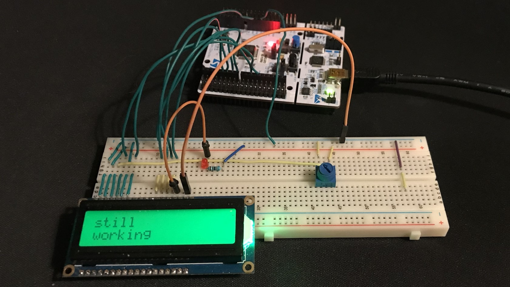

# stm32-demo

This is a school project *(scrum)* that is organized with Azure DevOps. It's a UCOS3 project.

**Key Functionality**
- Different functionalities run in separate RTOS tasks

- MODBUS slave and master modules
- Sensor reading with slave modules
- Showing readings on master module
- Push button functionality to show different readings

Fork of Velho's stm32-demo project.
My part is to add LCD functionality to the project.
Current working branch is dev-uc3.

---

GPIO pinouts configurations are autogenerated by CubeIDE and are in
- [Core/Src/gpio.c](Core/Src/gpio.c)
- [Core/Inc/main.h](Core/Inc/main.h)

Pin mapping for the driver is found in
- [Core/Lib/BSP/lcd16x2/LCD16x2_cfg.c](Core/Lib/BSP/lcd16x2/LCD16x2_cfg.c)

---
Big thanks to the deepbluembedded.com for the driver example!
It was easy to understand with config files and separate delay function
that was easy to modify to our needs.

- [Core/Lib/BSP/lcd16x2](Core/Lib/BSP/lcd16x2)

---
My code LCD code can mainly be found in

- [Core/Inc/lcd_display.h](Core/Inc/lcd_display.h)
- [Core/Src/lcd_display.c](Core/Src/lcd_display.c)

It was also my responsibility to make UCOS3 task to update the lcd screen.

- [Core/Inc/app.h](Core/Inc/app.h)
- [Core/Src/app.c](Core/Src/app.c)